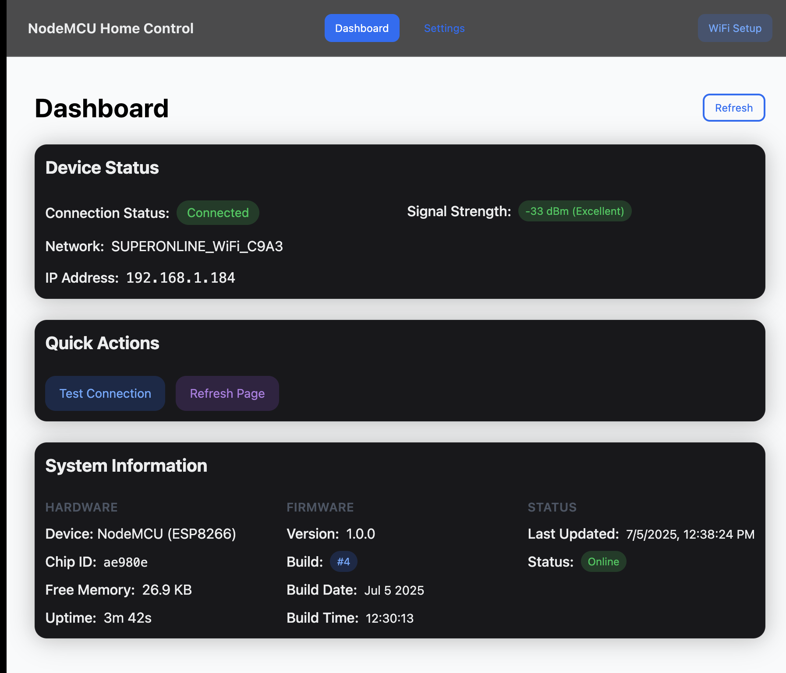

# ESPHome-Kit
NodeMCU ESP8266 based smart home control system with WiFi configuration portal and relay controls.

## Features
- WiFi configuration portal with captive portal support
- Modern React + TailwindCSS + HeroUI frontend
- Dual relay control (GPIO5/D1 and GPIO4/D2)
- Real-time device status monitoring
- Build number versioning system
- OTA firmware updates
- Responsive web interface

## Hardware Setup
- NodeMCU (ESP8266)
- 2-channel relay module (optional)
- Connect Relay 1 to GPIO5 (D1)
- Connect Relay 2 to GPIO4 (D2)

## Quick Start
1. Flash the firmware to NodeMCU
2. Connect to "NodeMCU-Setup" WiFi network
3. Configure your WiFi credentials
4. Access the web interface for device control

### Dashboard

## Documentation
- [Relay Controls Setup](RELAY_CONTROLS.md)
- [Build System](build.sh)

## API Endpoints
- `GET /api/status` - Device status
- `GET /api/relays` - Relay states
- `POST /api/relay1` - Control relay 1
- `POST /api/relay2` - Control relay 2
- `GET /api/scan` - WiFi scan
- `POST /api/wifi` - WiFi configuration

